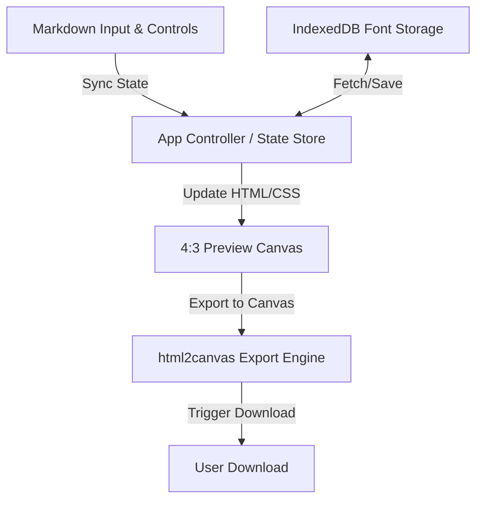

# Technical Plan & Architecture

This document describes the architectural layout and component responsibilities for the Quote Maker application.

## 1. Component Overview

---

## 2. File Responsibilities

### UI & Layout
*   **File:** [index.html](index.html)
*   **Purpose:** Provides the structural layout (split-screen editor vs. locked 3:4 preview canvas) and utility control elements (font selectors, sliders, color inputs, upload button).

### Core Logic & State Management
*   **File:** [app.js](app.js)
*   **Purpose:** Implements:
    *   State tracking for customization inputs (colors, active font, size, watermark).
    *   Markdown parser integration (using local `marked` parser).
    *   IndexedDB wrapper to read, write, and register custom uploaded web fonts.
    *   Image export logic using local `html2canvas` to render the preview to a 1536x2048 PNG.
    *   Keyboard shortcut event listeners on the markdown textarea (`Cmd/Ctrl` + `B`/`I`/`U`) to wrap selections.
    *   Reset handler to restore color pickers, font selectors, and font sizes to original defaults.

### Design System & Styling
*   **File:** [style.css](style.css)
*   **Purpose:** Standardizes the UI layout, styling for control panels, typography, custom highlighter CSS styling, custom background selections, and locking the 3:4 aspect ratio of the editor preview container. Includes explicit styling for custom scrollbars and utility reset buttons.

### Local Libraries (Offline/PWA support)
*   **Files:** 
    *   [marked.min.js](lib/marked.min.js)
    *   [html2canvas.min.js](lib/html2canvas.min.js)
*   **Purpose:** Local minified vendor dependencies to allow standard Markdown parsing and canvas image export without relying on network CDNs.
